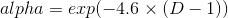
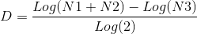

# FRAMA (Fractal Adaptive Moving Average) in Python
## Introduction
The aim of this repository is to provide functions of FRAMA written
in python for both educational and industrial purposes. FRAMA is a
state of the art Moving Average estimator(or was by the time u read this...).
It is used in economics for stock prices and Wall Street stuff, but
it can also be used from anyone as a better moving average algorithm.
It works better on time series which present the same shape despite the
length of the data timestamps type (sec, minutes, hours, days,...).


## Libraries & Dependencies

+ `Numpy` for the basic implementation
+ `Pytorch` not obligatory
+ `Matplotlib` to plot the results


This work works in `Python 3+` 


## Quick Start

Run the example script:

```bash
python src/frama_use_case.py
```

This will:

- Generate a FRAMA example image at `images/frama_example_plot.png`
- Generate additional plots across noise and batch settings:
    - `images/frama_plot_noise_0.1.png`
    - `images/frama_plot_noise_0.2.png`
    - `images/frama_plot_noise_0.5.png`
    - `images/frama_plot_batch_10.png`
    - `images/frama_plot_batch_50.png`
    - `images/frama_plot_batch_100.png`


## Explanation
To present the inside workings we will use a top-down approach.
The algorithm uses an adaptive low-pass filter with one term `alpha`.
So it should look something like this:
```python
    for i in range(1,N):
        Filt[i+1] = alpha * InputPrice[i] + (1 - alpha) * Filt[i]
```
Now the problem is how do we calculate alpha at each step?

`alpha` is changed according to something called the fractal dimension.

So alpha is calculated as 



The fractal dimension id D needs to be computed at every iteration step.
The fractal dimension is defined by this relation:



where `N1` and `N2` are defined as: 
```python
    N1 = (max(v1) - min(v1)) / batch
    N2 = (max(v2) - min(v2)) / batch    
```
where `v1` is a batch of the input and `v2` is exactly the next
batch of the input. `batch` is the number of data points per batch.

Now `N3` is defined as
```python
    N3 = (max([v1,v2]) - min([v1,v2])) / (2*batch)
```
and is the maximum over both batches and devided by the number of 
data points inside them.

Now, if you go from down up it will result in the code inside `frama_educative.py`.

If still not satisfied from the explanation check the code and the References.
## Results Galery


Feel free to send me your own examples! Thanks!

## References
1. Ehlers, John. "FRAMA–Fractal Adaptive Moving Average." Technical Analysis of Stocks & Commodities (2005).
